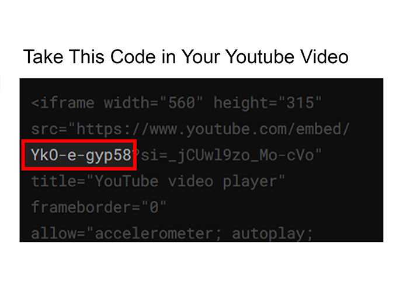

<p href="#" align="center">
  
  <h1 align="center">Weedingly</h1>
  <p align="center">
        Made with ❤️ by <a ref="https://github.com/petershaan12">Peter Shaan</a>.
    </p>
</p>

<p align="center">
  Weedingly Free – an open-source wedding invitation. </br>
</p>

<p align="center">
 <a href="https://nextjs.org/">
       
    </a>
    <a href="https://www.mongodb.com/">
        
    </a>
    <a href="https://vercel.com"></a>
     <a href="https://github.com/petershaan12/Weddingly-Free/blob/main/LICENSE">
        
    </a>
</p>

## About

This is a modern and fully customizable wedding invitation template built using **Next.js**, **TypeScript**, **TailwindCSS**, **react-type-animation**, and **react-intersection-observer**. It's designed to be user-friendly, allowing couples to personalize their wedding details easily.

## RSVP Feature with MongoDB

Weedingly includes a built-in RSVP feature that allows guests to confirm their attendance easily. The RSVP form can be customized to include additional questions or information as needed. The responses are stored in a database for easy management and tracking.

---

This project was inspired by the beautiful designs found on [Groove Public](https://groovepublic.com/reveused/). You can edit, improvise, and customize the template to suit your unique wedding theme and preferences. Feel free to add your personal touch and make it truly yours 🥳😃.

---

## Features

- **Next.js + TypeScript**: A modern framework for building fast and scalable web applications.
- **TailwindCSS**: A utility-first CSS framework for rapid UI development.
- **react-type-animation**: Animate typewriter-style text on your invitation.
- **react-intersection-observer**: Enable smooth animations as the user scrolls.
- **Dynamic Configuration**: Use environment variables to update wedding details like dates, locations, and Google Maps links.
- **Responsive Design**: Fully responsive design that works on various screen sizes.
- **RSVP Management**: Easily manage guest responses with a built-in RSVP feature.
- **MongoDB Integration**: Store and manage RSVP data using MongoDB.
- **Customizable RSVP Form**: Tailor the RSVP form to include additional questions or information.
- **RSVP Tracking**: Keep track of guest responses and manage attendance efficiently.

---

## How to Use

1. **Clone the repository**:

   ```bash
   git clone https://github.com/petershaan12/wedding-invitation.git
   cd wedding-invitation
   npm i
   ```
2. **Set up environment variables: Create a .env.local file in your root directory and add the following in .env.example**
3. **Create Database in MongoDB**:
   Create a new database in MongoDB and name it `wish`. Inside this database, create a collection named `wishes`.
4. **Run The Project**

    ```bash
    npm install
    npm run dev
    ```

5. **Deploy to Vercel**:

    You can easily deploy your project to Vercel by following these steps:

    - If you don't have a Vercel account, sign up at [vercel.com](https://vercel.com/).
    - Install the Vercel CLI:

      ```bash
      npm install -g vercel
      ```

    - Run the following command in your project directory:

      ```bash
      vercel
      ```

    - Follow the prompts to link your project to your Vercel account and deploy it.

    Your wedding invitation will be live and accessible via the URL provided by Vercel.

## Contributing

This project is open to contributions. Feel free to fork it, improve it, or submit pull requests with new features or fixes.

## Customization

You can customize the following via environment variables:

* Wedding Name, Dates, Countdown
* Your OWN RSVP
* Music in `public\music\wedding_song.mp3`
* Picture in the public folder

  * `public/slide_1 to slide_9` for the slider images on each slide.
  * `public/foto_1_samping` for the desktop view picture.
  * `public/foto_1 to foto_4` for fade-in animations at the start of the page.
* Event Details (Holy Matrimony & Wedding Reception)
* Google Maps Links
* Youtube Links For Streaming
* YouTube Code Embed for Video : Embed YouTube videos using iframe code and take the foto like below

<p align="center">

</p>

* Custom Guest Names: If you'd like to personalize guest names such as Dear Peter or to:John, set your url with "to:".
  ex (`https://wedding-invitation-five-black.vercel.app/to:peter`)

## License

This template is provided under the MIT License. You are free to use, modify, and distribute it.
